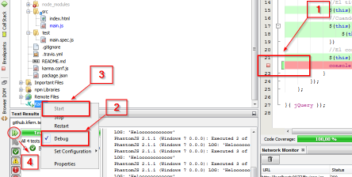
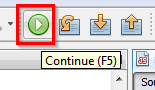

# Depurar con Netbeans IDE 8.1 usando Karma

## Breakpoints y observación de variables:

[Ver imagen ampliada](img/depurar_con_netbeans_karma.png)

1. Establecer el punto de parada.
2. Activar el modo Debug en Karma → Menú contextual → Debug
3. Iniciar Karma mediante Karma → Menú contextual → Start
4. Al pulsar en Icono Rerun (Marcado con el 4) la ejecución se detiene en el punto de parada. Si se sitúa el puntero del ratón sobre algún objeto o variable se muestra la información relacionada. También se puede abrir la ventana Variables (Menú superior → Window → Debugging → Variables)
5. Para continuar la ejecución hay que pulsar F5 o en el botón Continúe de la barra de herramientas.

